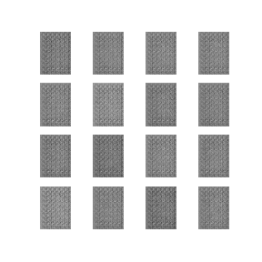

# SIP-GAN
This package provides an implementation of the SIP-GAN generative method. This is a new model for SIP traffic generation that was published in IEEE ISNCC-2021. For simplicity, we refer to this model as SIP-GAN throughout the rest of this document.

<p align="center">
  
</p>

<p align="center">
  figure: adversarial network traffic generation
</p>

Any publication that discloses findings arising from using this source code or
the model parameters should [cite](#citing-this-work) the SIP-GAN paper.

Main contact: Amar Meddahi (amar.meddahi1@gmail.com)

## Overview

We propose “SIP-GAN” an extension and adaptation of GANs model for SIP (network protocol used for real-time applications), aiming to process and generate SIP traffic at packet level. The proposed generic model includes an encoder, a generator, and a decoder.

Useful resources are available for potential contributors or those interested in the project:
- [SIP-GAN Paper](https://drive.google.com/file/d/1X66ifhVLQoRDOEl8Ey0kwR1-srvdacHw/view?usp=sharing)
- [Oral Presentation (slides)](https://drive.google.com/file/d/1Xl46KMwDamX3znYjbPYyNmzu1ioW0Ise/view?usp=sharing)
- [Oral Presentation (video)](https://drive.google.com/file/d/12PVA1hKk4zl4lIk-27NZ8gppLSMDUOZ1/view?usp=sharing)

## SIP-GAN Package

In this GitHub repository you will find the following files:
- code/SIP_INVITE_20000.txt: The dataset used to train the SIP-GAN model. This dataset corresponds to the captured data from 20,000 SIP INVITE requests sent through the network.
- code/toolbox.py: The library containing all the functions useful for the operation of SIP-GAN (in particular the encoder and decoder).
- code/generator.py: The SIP-GAN generator. 
- code/dataset.py: A python script showing an example of how to preprocessed the data and use the SIP-GAN encoder/decoder.

This python package is the one that allowed to validate experimentally the approach proposed in the paper. If you have any question about the source code, please contact me.

## Citing this work

If you use the code or data in this package, please cite:

```bibtex
@Article{SIPGAN2021,
  author  = {Amar Meddahi and Hassen Drira and Ahmed Meddahi},
  journal = {IEEE 2021 International Symposium on Networks, Computers and Communications
(ISNCC'21)},
  title   = {{SIP-GAN:} Generative Adversarial Networks for {SIP} traffic generation},
  year    = {2021},
}
```

## Acknowledgements

SIP-GAN communicates with and/or references the following separate libraries
and packages:

*   [matplotlib](https://matplotlib.org/)
*   [NumPy](https://numpy.org)
*   [TensorFlow](https://github.com/tensorflow/tensorflow)

We thank all their contributors and maintainers!
